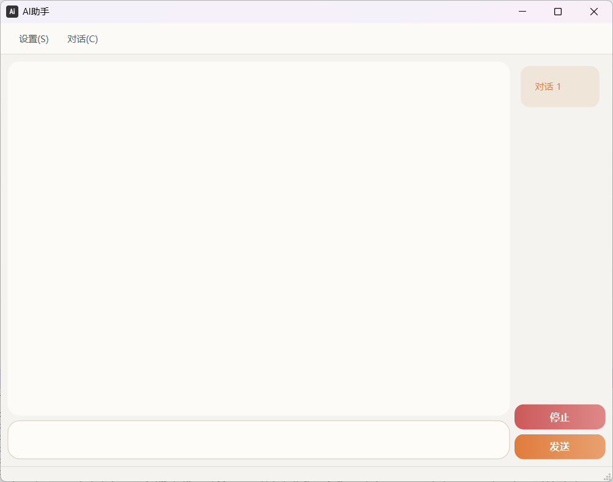
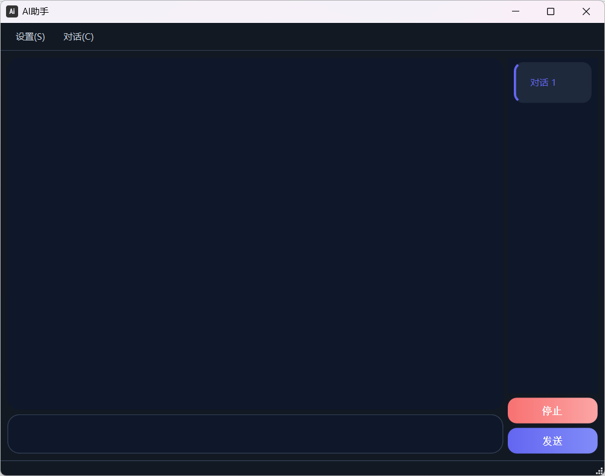

# DeepSeek-QT Client

基于 Qt 6 开发的 DeepSeek API 桌面客户端，支持多会话、流式输出、Markdown 渲染、深色/浅色主题等功能。

[](LICENSE)
[](https://www.qt.io/)

## ✨ 功能亮点

- 🗂️ **多会话管理** – 新建、重命名、删除对话，历史记录自动保存到 `sessions.json`
- 💬 **流式对话** – 实时显示 AI 回复，支持停止生成
- 🎨 **Markdown 渲染** – 代码高亮、表格、列表、引用等格式完美支持
- 🌗 **深色/浅色主题** – 一键切换，保护视力
- ⚙️ **可配置参数** – API Key、模型、温度、最大 Token、思考模式
- 📤 **导出对话** – 支持导出为 Markdown、HTML 或纯文本
- ⌨️ **快捷键** – 发送(Ctrl+Enter)、新建(Ctrl+N)、删除(Ctrl+D) 等
- 🔒 **本地存储** – 所有对话记录保存在本地，隐私可控

## 📸 截图

| 亮色主题                          | 深色主题                        |
| --------------------------------- | ------------------------------- |
|  |  |

## 🚀 安装与运行

### 环境要求
- Qt 6.4 或更高版本
- CMake 3.16+
- 支持 C++17 的编译器（MSVC 2022 / MinGW 64-bit）

### 从源码编译

```bash
git clone https://github.com//Stan-Vincent//DeepSeek-API-Client-QT//DeepSeek-QT.git
cd DeepSeek-QT
mkdir build && cd build
cmake ..
cmake --build .
